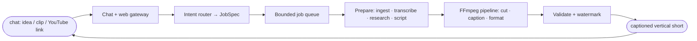

<div align="center">

# 🎬 FrameOS

### Your video editor lives in chat.

Turn a prompt, a raw clip, or a YouTube link into a captioned vertical short, just by asking.
No CapCut, no timeline to timeline hassle, no converter sites.

[](https://frameos.app)
[](https://t.me/FrameOSBot)


</div>

---

## The Vision

Editing a short-form video traditionally requires jumping between multiple single-purpose tools: CapCut to trim, one web app to convert, another to generate captions, and another to edit audio.

**FrameOS collapses all of it into a single conversational surface.** You talk to it like an editor:

> *"make a 15s reel on why UPI beat credit cards"*
> *"clip 2:30-3:15 from this YouTube link and caption it"*
> *"make this vertical with a watermark"*

…and it hands back a finished, captioned, vertical short in seconds. It operates where you already are — on **Telegram** and the **web**.

## Three Modes, One Pipeline

Every mode runs through a unified, high-performance media execution pipeline:

| Mode | Input | Output |
|------|-------|--------|
| 🧠 **Generate** | Topic or prompt | A brainstormed, scripted, voiced **14-20s reel** with captions |
| ✂️ **Edit** | Clip + instruction | Trimmed, captioned, reformatted 9:16 vertical short |
| 📎 **Clip** | YouTube URL + timestamps | Extracted segment, captioned and formatted vertically |

## Architecture



Conversational requests are parsed into typed **JobSpec** definitions. A bounded, queue-managed pipeline enforces concurrency and resource bounds. FFmpeg executes media transformations natively, validating outputs before final delivery.

## Technology Stack

| Component | Technology |
|---|---|
| **Frontend** | React 19, Vite, Tailwind CSS, Framer Motion |
| **Backend Engine** | Node.js, TypeScript, FFmpeg, yt-dlp |
| **Database & Queue** | Convex (waitlist, credits, job queue, user persistence) |
| **Authentication** | Clerk (Google OAuth) |
| **Voice & Speech** | ElevenLabs (TTS), OpenAI Whisper (Speech-to-Text) |
| **Email & Analytics** | Resend (transactional welcome emails), PostHog |
| **Storage & Gateway** | Google Cloud Storage (V4 signed URLs), Telegram Bot API |

## Local Development

```bash
# Frontend & App
npm install
npm run dev            # http://localhost:5173

# Backend Media Engine
cd backend
npm install
npm test
npm run frameos -- "clip https://youtu.be/aqz-KE-bpKQ 0:02 to 0:06"
```

Copy `.env.example` to `.env.local` (root) and `backend/.env.example` to `backend/.env`.

## Documentation

- [Architecture](./docs/ARCHITECTURE.md)
- [Setup Guide](./docs/SETUP.md)
- [Testing Suite](./docs/TESTS.md)

## License

MIT. See [LICENSE](./backend/LICENSE).
