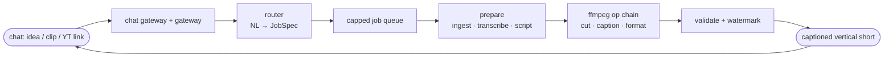

<div align="center">

# 🎬 FrameOS Backend

**A chat-native media engine for vertical short video creation.**
Send an idea, a raw clip, or a YouTube link, get back a captioned vertical short.
The AI agent scripts, ffmpeg cuts and captions. No timeline editors, no converter sites.


</div>

---

## Why

Editing a short-form video requires jumping between multiple bloated applications: trimming, converting, captioning, and formatting.

**FrameOS collapses all of it into a simple chat or API request**: talk to it like an editor, and get a finished short back in seconds.

## Three modes, one engine

| Mode | You send | You get |
|------|----------|---------|
| 🧠 **Generate** | a topic (*"why UPI beat credit cards"*) | brainstormed viral script, voiced (ElevenLabs), rendered **14-20s reel** |
| ✂️ **Edit** | a raw clip + *"caption it, make it vertical"* | transcribed (Whisper), captioned, formatted 9:16 |
| 📎 **Clip** | a YouTube link + *"2:30 to 3:15"* | yt-dlp grabs **only that segment** → captioned vertical short |

## How it works



## Quickstart

```bash
npm install
npm run build        # tsc
npm test             # run test suite

# run any mode from the terminal:
npm run frameos -- "why UPI beat credit cards in india"                     # generate
npm run frameos -- "make it vertical with a watermark" fixtures/sample.mp4  # edit
npm run frameos -- "clip https://youtu.be/aqz-KE-bpKQ 0:02 to 0:06"         # clip (yt-dlp)
```

Each prints the path to a real **1080×1920** `.mp4`. To run the live Telegram bot: set `TELEGRAM_BOT_TOKEN` in `.env` and `npm run gateway`.

## Integrations

| Component | Responsibility |
|---|---|
| **FFmpeg** | media ops (cutting, caption burning, formatting, cropping) |
| **yt-dlp** | segment-only YouTube download |
| **Whisper** | speech-to-text transcription |
| **ElevenLabs** | AI voiceover generation |
| **Convex** | job queue, credits, user persistence |
| **Google Cloud Storage** | rendered reel storage & V4 signed URL delivery |

## Resource Safety & Limits

- Global concurrency bounded to CPU core limits (`cores - 1`).
- Hard limits per job: **≤50 MB · ≤5 min · ≤1080p · timeout guard**.
- Isolated temporary directories created and deleted after export.
- Inputs validated against SSRF and strict execution schemas.

## Project Structure

```
src/
├─ types.ts        # contracts (Op, JobSpec, module interfaces)
├─ router/         # NL → validated JobSpec
├─ queue/          # capped executor (concurrency, timeout, cleanup)
├─ media/          # ffmpeg op library + caption builders
├─ ingest/         # yt-dlp segment download
├─ transcribe/     # Whisper client
├─ content/        # script & caption generation (LLM)
├─ gateway/        # Telegram chat gateway
├─ app.ts          # pipeline integration
└─ cli.ts          # terminal harness
```

## License

MIT. See [LICENSE](./LICENSE).
